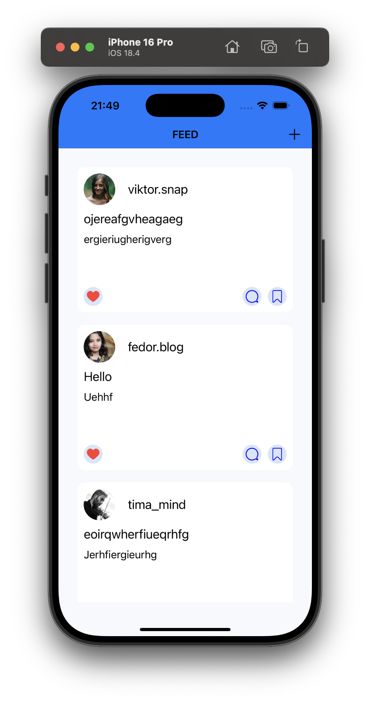

# Social Media Feed App

A simplified social media feed iOS app built using **UIKit** and **Core Data**, following the **MVC architecture** pattern.

This app allows users to:
- View a feed of posts
- Add posts manually
- Like/unlike posts (state saved in Core Data)
- Delete posts
- Pull to refresh the feed

---

##  Architecture

The app follows the **Model-View-Controller (MVC)** pattern:

- **Model**: Core Data entities (`Post`) handle persistent storage.
- **View**: Custom `UITableViewCell`, reusable modal views for post creation.
- **Controller**: `ViewController` manages data flow, Core Data logic, UI actions, and table view updates.

---

## Screenshots
Feed Screen 

Add Post Screen

Like Posts

---

## Technologies Used

- **UIKit**
- **Core Data**
- **MVC Architecture**
- **UITableView & Custom Cells**
- **Auto Layout**
- **Pull to Refresh**

